# CustomHierarchyColor

## 概要
Hierarchy上を見やすくするために作成しました。
どっかで見たことあったのですが、カスタイマイズできるように自作しました。
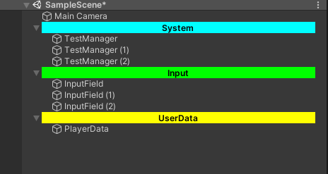
## インストール
PackageManagerのURLで追加する
`https://github.com/MoritaShouta/CustomHierarchyColor.git`で追加できます。
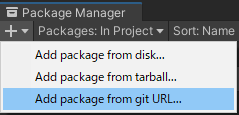
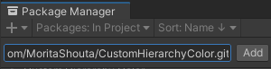

それ以外に、`"com.figse.customhierarchycolor":"https://github.com/MoritaShouta/CustomHierarchyColor.git"`を直接`Packages/manifest.json`に追加しても大丈夫です。

## 使用方法
最初はこのようなエラーが出ます、これは設定ファイルが存在しないためエラーが発生します。
正常です。
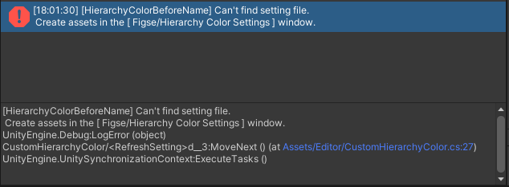

設定ファイルを追加します,`Create HierarchyColorSettings Asset`をクリックするとファイルが生成されます。
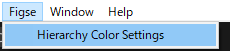
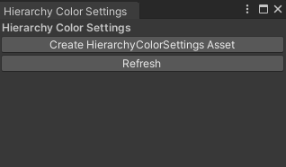

試しに`/// `の文字列が存在する名前を対象にします。この時`FontColor`のalpha値の変更を忘れないで下さい。
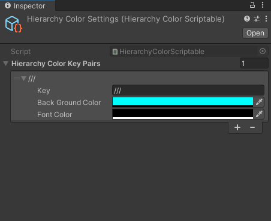

このようになります
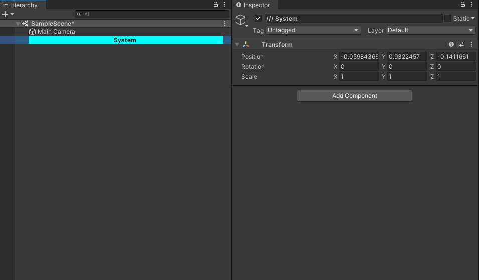

増やしてみます
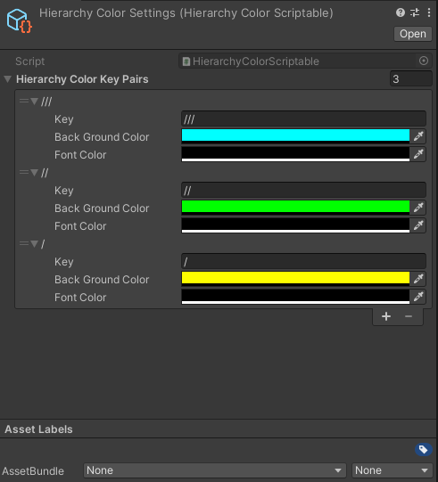
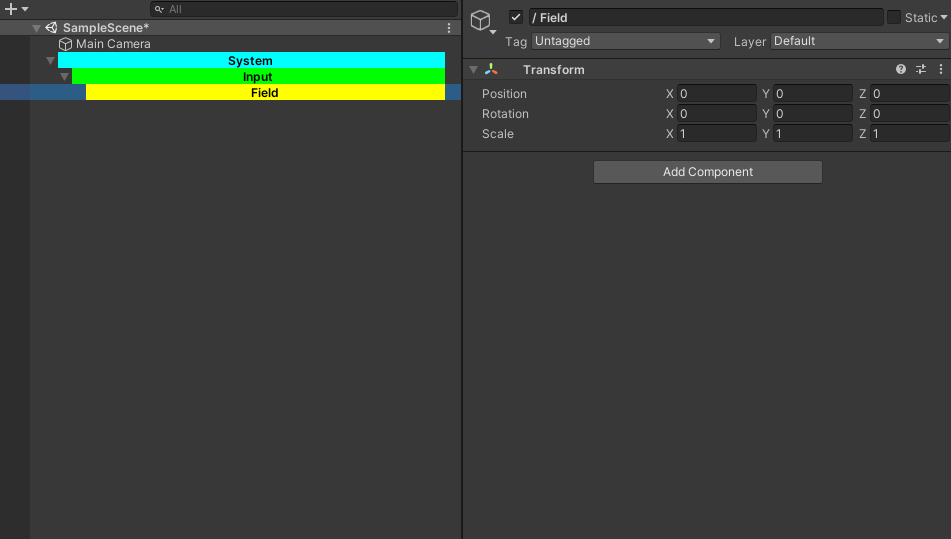

## うまくいかない場合
上から優先度が決まります、なので一番上が優先度一番高いです。優先度をチェックしてください。
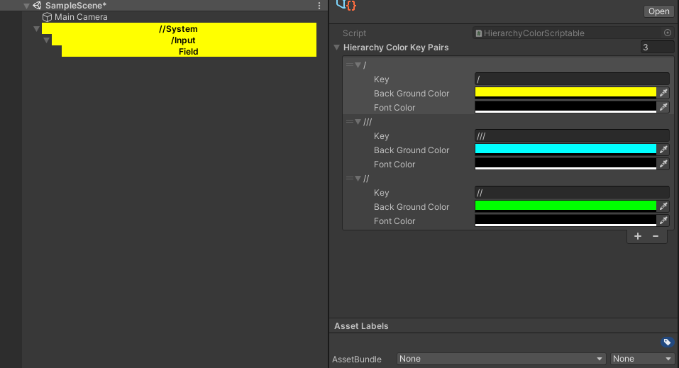

文字列検索で作成されているため、指定した文字列がどこに入ったとしても反応してしまいます。これは修正予定です。
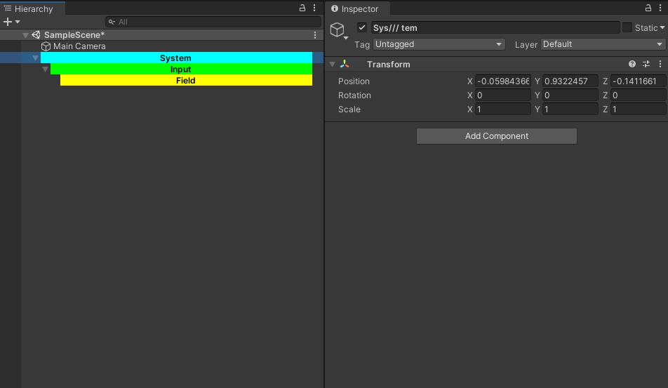